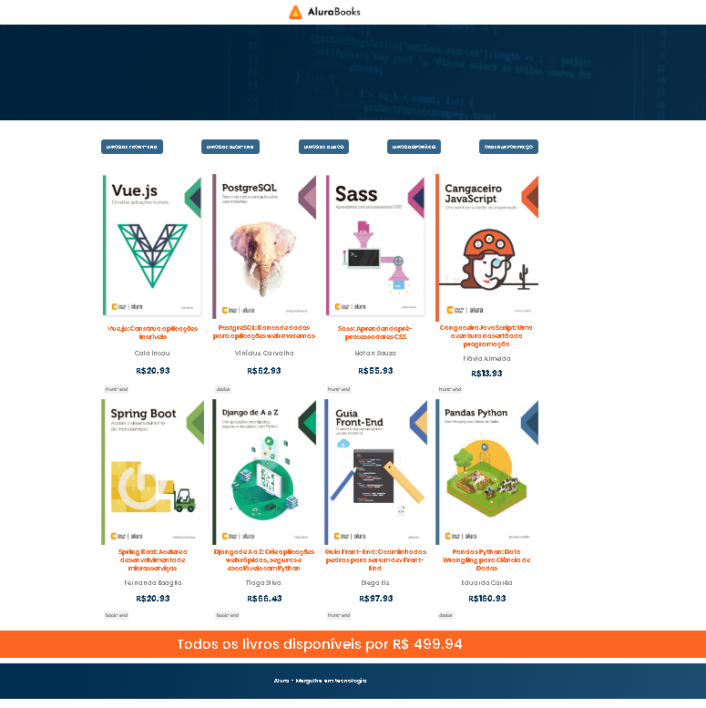

<h1 align="center"> AluraBooks </h1>

Programa promovido pela Alura para ensino de tecnologias focado na prática em como utilizar os principais métodos de array com JavaScript  

  

## 🚀 Tecnologias

Esse projeto foi desenvolvido com as seguintes tecnologias:

- HTML e CSS
- JavaScript

Com foco dentro do JavaScript utilizando

- forEach
- Map
- Filter
- Sort
- Reduce
